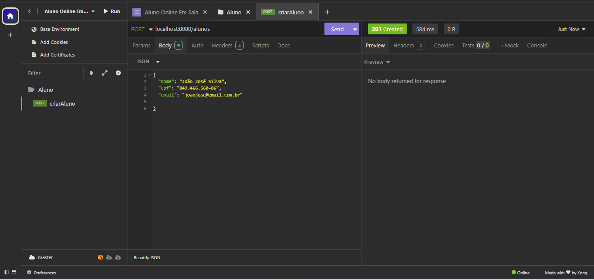

 

# Olá, sejam bem-vindos!:wave:

 

 

## Sobre :books:
- Sou **Richelle Monteiro**, estudante do 3º período B noite de Sistemas para Internet no Centro Universitário-UNIESP;
- Esse repositório é a disciplina de Tecnologia para Back-end I, prof Kelson Almeida
- O projeto é um sistema de cadastro Alunos, Professores e Disciplinas [em desenvolvimento]

## Recursos

 - Java;
 - Spring Boot

## Atividades

#### Atividade 1

###### Criação de Aluno

a. Print Insomnia (Post criar Aluno - 201 Created)

b. Print DBeaver (Criação Aluno - banco de dados)

