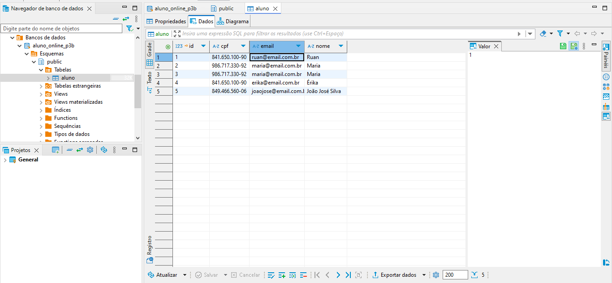
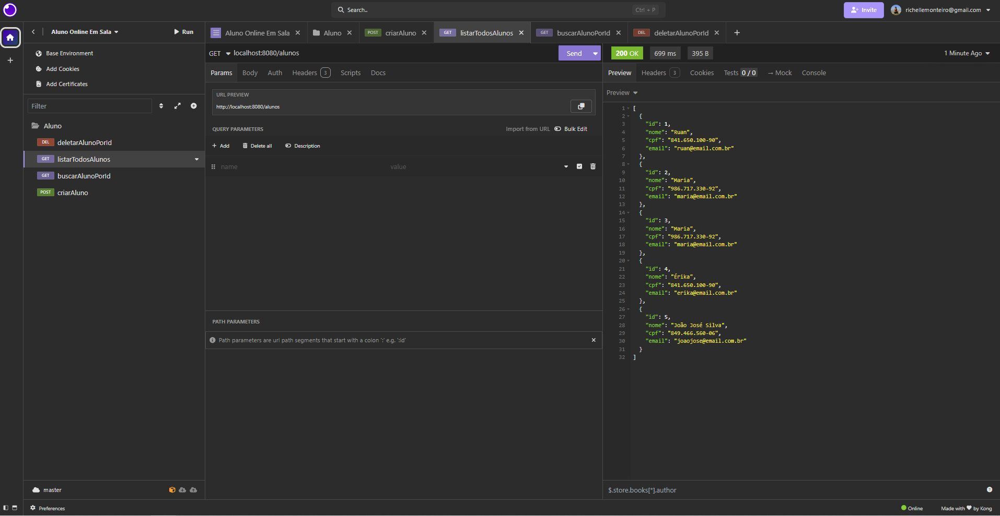
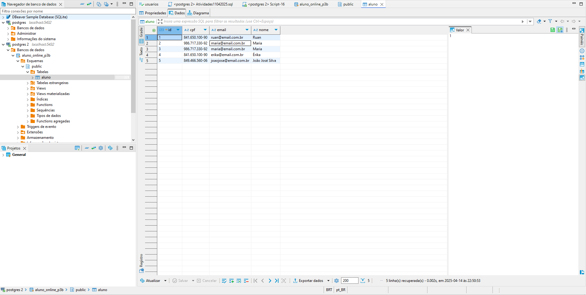
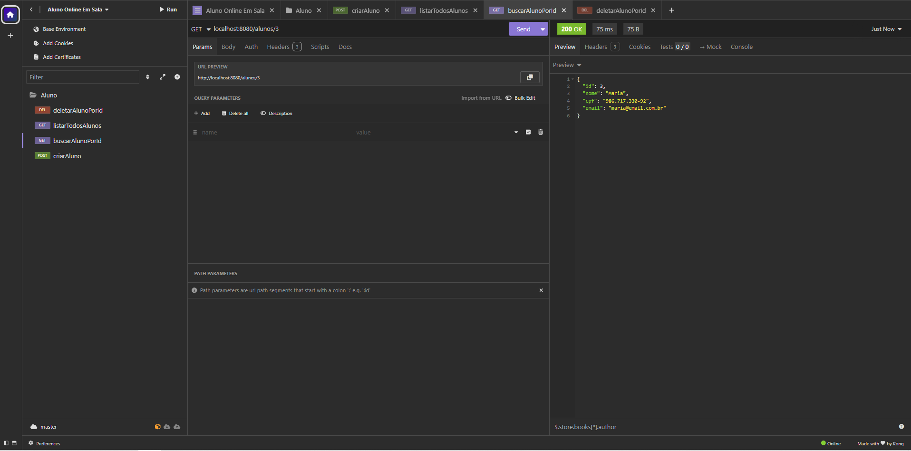
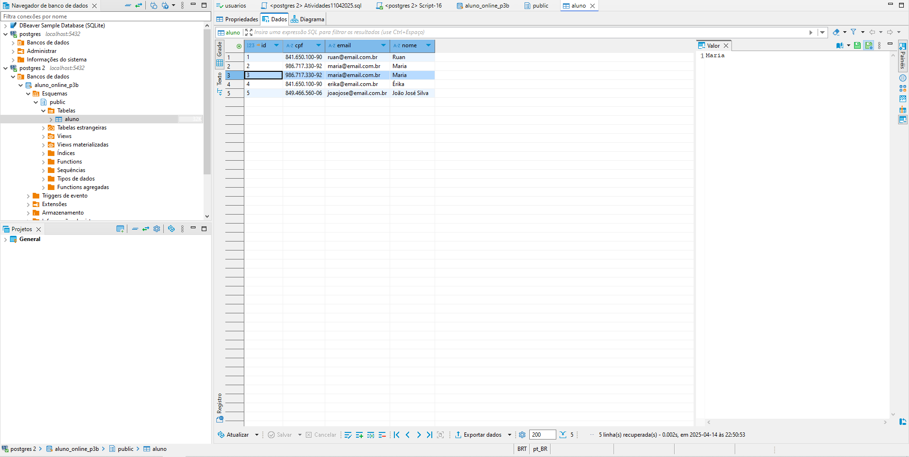
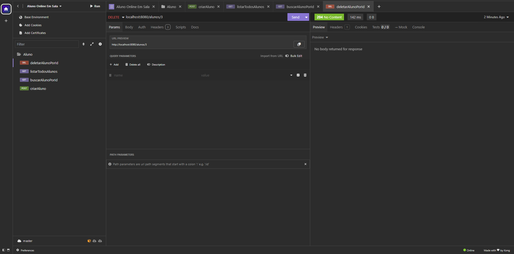
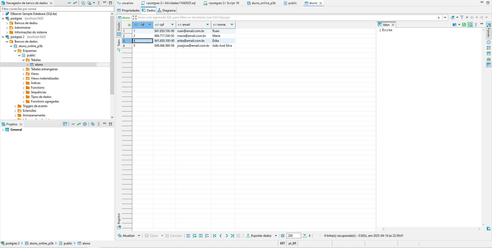

 

# Olá, sejam bem-vindos! 👋

 

 

## 📖 Sumário

- [Sobre](#-sobre)
- [Recursos](#-recursos)
- [Atividades](#-atividades)
  - [Atividade 1](#atividade-1)
    - Criar Aluno
  - [Atividade 2](#atividade-2)
    - Listar Todos Alunos
    - Buscar Aluno pelo ID
    - Deletar Aluno por ID

## 📚 Sobre
- Sou **Richelle Monteiro**, estudante do 3º período B noite de Sistemas para Internet no Centro Universitário-UNIESP;
- Esse repositório é destinado à disciplina de Tecnologia para Back-end I, prof Kelson Almeida
- O projeto é um sistema de cadastro Alunos, Professores e Disciplinas [em desenvolvimento]

## 🛠️ Recursos

 - Java;
 - Spring Boot
 - IntelliJ IDEA

## 🎯 Atividades

#### Atividade 1

###### Criar Aluno

a. Print Insomnia (POST Criar Aluno - 201 Created)

b. Print DBeaver (Criação Aluno - banco de dados)

[⬆ Voltar ao sumário](#-sumário)

#### Atividade 2

###### Listar Todos os Alunos

a. Print Insomnia (GET Listar Todos Alunos - 200 OK)

b. Print DBeaver (Listar Todos Alunos - banco de dados)

###### Buscar Aluno pelo ID

a. Print Insomnia (GET Buscar Aluno pelo ID - 200 OK)

b. Print DBeaver (Aluno código 3 - banco de dados)

###### Deletar Aluno pelo ID

a. Print Insomnia (DELETE Deletar Aluno pelo ID - 200 OK)

b. Print DBeaver (Aluno código 3 deletado - banco de dados)

[⬆ Voltar ao sumário](#-sumário)

